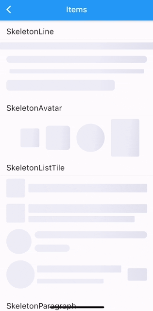
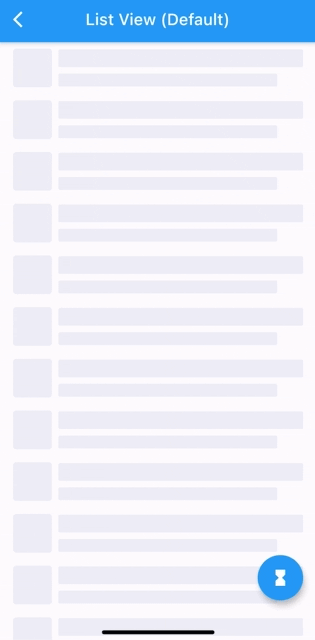
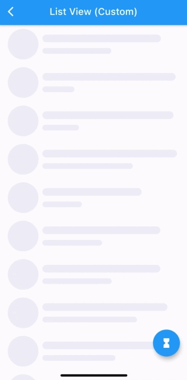
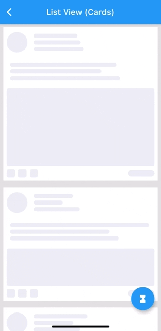
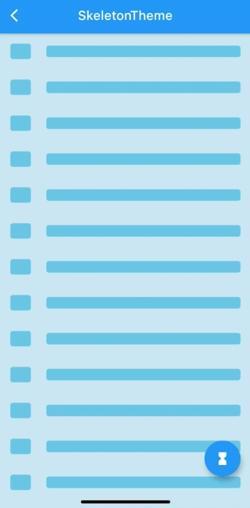
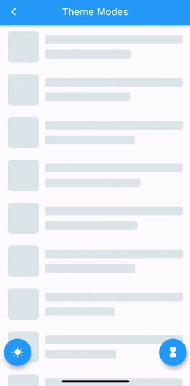
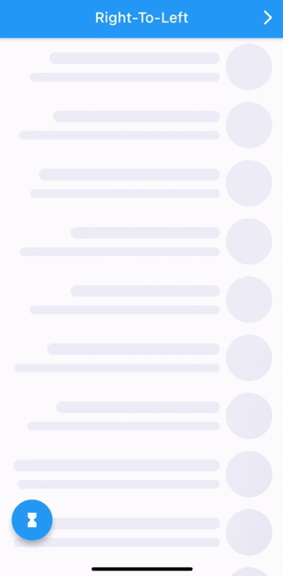
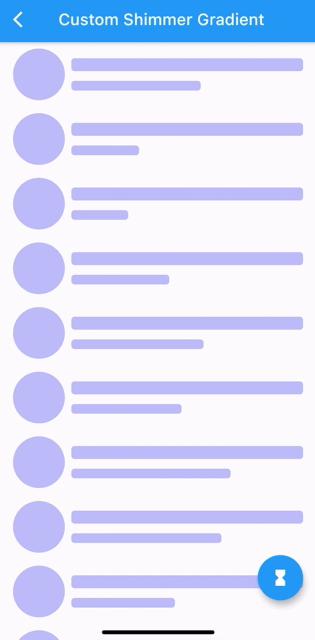

# Skeletons

A Flutter package for building custom skeleton widgets to mimic the page's layout while loading.

## Examples


| Items |  | ListView (Default) |
| ------------- | ------------- | ------------- |
|   |   |   |

| ListView (Custom) | ListView (Complex Cards) | SkeletonTheme  |
| ------------- |  ------------- | ------------- |
|   |  |   |

| Light/Dark modes | Right-To-Left  | Custom Shimmer |
| ------------- | ------------- | ------------- |
|   |   |   |


All examples can be found here [examples](https://github.com/badjio/skeletons/tree/master/example/lib/examples).


## How To Use

Can be used by encapsulating the child widget in a Skeleton widget:

```dart
import 'package:skeletons/skeletons.dart';

Skeleton(
        isLoading: _isLoading,
        skeleton: SkeletonListView(),
        child: Container(child: Center(child: Text("Content"))),
      )
 ```

 or directly:

 ```dart
 Container(
     child: _isLoading 
     ? SkeletonListView() 
     : Container(child: Center(
                        child: Text("Content"))),
 )

 ```

a `SkeletonTheme` can be used to set the default configs for all skeleton descendants in the tree.

```dart
SkeletonTheme(
    // themeMode: ThemeMode.light,
    shimmerGradient: LinearGradient(
        colors: [
          Color(0xFFD8E3E7),
          Color(0xFFC8D5DA),
          Color(0xFFD8E3E7),
        ],
        stops: [
          0.1,
          0.5,
          0.9,
        ],
      ),
      darkShimmerGradient: LinearGradient(
        colors: [
          Color(0xFF222222),
          Color(0xFF242424),
          Color(0xFF2B2B2B),
          Color(0xFF242424),
          Color(0xFF222222),
        ],
        stops: [
          0.0,
          0.2,
          0.5,
          0.8,
          1,
        ],
        begin: Alignment(-2.4, -0.2),
        end: Alignment(2.4, 0.2),
        tileMode: TileMode.clamp,
      ),
        child: MateriaApp(
            ...
        ),
      ),
```


## More Customization:

| ListView (Complex Cards) |
| ------------- |
|  |

for more complex shapes you can build your skeleton inside a `SkeletonItem` widget:

```dart
ListView.builder(
  physics: NeverScrollableScrollPhysics(),
  itemCount: 5,
  itemBuilder: (context, index) => Padding(
    padding: const EdgeInsets.all(8.0),
    child: Container(
      padding: const EdgeInsets.all(8.0),
      decoration: BoxDecoration(color: Colors.white),
      child: SkeletonItem(
          child: Column(
        children: [
          Row(
            children: [
              SkeletonAvatar(
                style: SkeletonAvatarStyle(
                    shape: BoxShape.circle, width: 50, height: 50),
              ),
              SizedBox(width: 8),
              Expanded(
                child: SkeletonParagraph(
                  style: SkeletonParagraphStyle(
                      lines: 3,
                      spacing: 6,
                      lineStyle: SkeletonLineStyle(
                        randomLength: true,
                        height: 10,
                        borderRadius: BorderRadius.circular(8),
                        minLength: MediaQuery.of(context).size.width / 6,
                        maxLength: MediaQuery.of(context).size.width / 3,
                      )),
                ),
              )
            ],
          ),
          SizedBox(height: 12),
          SkeletonParagraph(
            style: SkeletonParagraphStyle(
                lines: 3,
                spacing: 6,
                lineStyle: SkeletonLineStyle(
                  randomLength: true,
                  height: 10,
                  borderRadius: BorderRadius.circular(8),
                  minLength: MediaQuery.of(context).size.width / 2,
                )),
          ),
          SizedBox(height: 12),
          SkeletonAvatar(
            style: SkeletonAvatarStyle(
              width: double.infinity,
              minHeight: MediaQuery.of(context).size.height / 8,
              maxHeight: MediaQuery.of(context).size.height / 3,
            ),
          ),
          SizedBox(height: 8),
          Row(
            mainAxisAlignment: MainAxisAlignment.spaceBetween,
            children: [
              Row(
                children: [
                  SkeletonAvatar(
                      style: SkeletonAvatarStyle(width: 20, height: 20)),
                  SizedBox(width: 8),
                  SkeletonAvatar(
                      style: SkeletonAvatarStyle(width: 20, height: 20)),
                  SizedBox(width: 8),
                  SkeletonAvatar(
                      style: SkeletonAvatarStyle(width: 20, height: 20)),
                ],
              ),
              SkeletonLine(
                style: SkeletonLineStyle(
                    height: 16,
                    width: 64,
                    borderRadius: BorderRadius.circular(8)),
              )
            ],
          )
        ],
      )),
    ),
  ),
);
```

## Issues and feedback

For issues, please report [here](https://github.com/badjio/skeletons/issues). Contributions are welcome.


